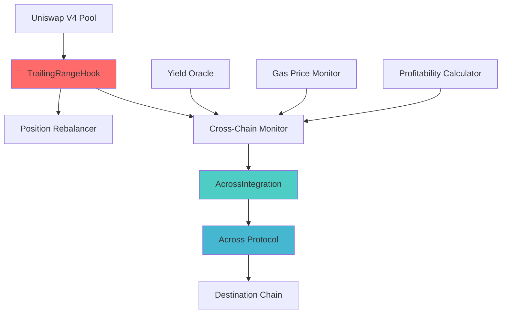

# 🌉 Cross-Chain Trailing-Range Rebalancer

> A revolutionary Uniswap v4 hook that automatically maintains active liquidity positions and migrates them across chains for optimal yield.

[](https://opensource.org/licenses/MIT)
[](https://hardhat.org/)
[](https://docs.soliditylang.org/)

## 🚀 Overview

The Cross-Chain Trailing-Range Rebalancer is an advanced DeFi infrastructure project that combines:

- **Uniswap v4 Hooks**: Automatic liquidity position management
- **Across Protocol Integration**: Secure cross-chain asset bridging
- **Intelligent Rebalancing**: Dynamic tick range adjustment based on price movements
- **Yield Optimization**: Cross-chain migration for better returns
- **Capital Efficiency**: Maximized fee capture for liquidity providers

### 🎯 Key Features

- ✅ **Automatic Rebalancing**: Keeps liquidity positions centered around market price
- ✅ **Cross-Chain Migration**: Moves liquidity to chains with better yields
- ✅ **Gas Optimization**: Smart cooldown mechanisms and profitability checks
- ✅ **Multi-Chain Support**: Ethereum, Polygon, Arbitrum, Optimism, Base
- ✅ **Emergency Controls**: Pause mechanisms and emergency withdrawals
- ✅ **Real-time Monitoring**: Comprehensive tracking and analytics

## 🏗️ Architecture



### Core Components

1. **TrailingRangeHook.sol**: Main Uniswap v4 hook contract
2. **AcrossIntegration.sol**: Cross-chain bridging logic
3. **CrossChainRebalancer.sol**: Migration orchestration
4. **PositionMath.sol**: Mathematical calculations
5. **CrossChainUtils.sol**: Utility functions

## 📋 Prerequisites

Before you begin, ensure you have:

- Node.js (v16+ recommended)
- npm or yarn
- Git
- Access to RPC endpoints for supported chains

## 🛠️ Installation & Setup

### 1. Clone the Repository

```bash
git clone <repository-url>
cd Uniswap-CCTR/xRange
```

### 2. Install Dependencies

```bash
npm install
```

### 3. Environment Configuration

Create a `.env` file in the `xRange` directory:

```env
# Private Keys
PRIVATE_KEY=your_private_key_here

# RPC URLs
ETHEREUM_RPC_URL=https://mainnet.infura.io/v3/your-key
POLYGON_RPC_URL=https://polygon-rpc.com
ARBITRUM_RPC_URL=https://arb1.arbitrum.io/rpc
OPTIMISM_RPC_URL=https://mainnet.optimism.io
BASE_RPC_URL=https://mainnet.base.org

# API Keys for Verification
ETHERSCAN_API_KEY=your_etherscan_key
POLYGONSCAN_API_KEY=your_polygonscan_key
ARBISCAN_API_KEY=your_arbiscan_key
OPTIMISM_API_KEY=your_optimism_key
BASESCAN_API_KEY=your_basescan_key

# Additional Config
REPORT_GAS=true
COINMARKETCAP_API_KEY=your_cmc_key
VERIFY_CONTRACTS=true

# Token Addresses (for monitoring)
USDC_ADDRESS=0xA0b86a33E6417b8d0d7e9f9E2e4e2e8E4e2e8E4e
WETH_ADDRESS=0xC02aaA39b223FE8D0A0e5C4F27eAD9083C756Cc2
```

### 4. Compile Contracts

```bash
npx hardhat compile
```

## 🚢 Deployment

### Local Development

```bash
# Start local Hardhat network
npx hardhat node

# Deploy to local network
npx hardhat run scripts/deploy.js --network localhost
```

### Testnet Deployment

```bash
# Deploy to Polygon Mumbai
npx hardhat run scripts/deploy.js --network polygon

# Deploy to Arbitrum Goerli
npx hardhat run scripts/deploy.js --network arbitrum
```

### Mainnet Deployment

```bash
# Deploy to Ethereum mainnet
npx hardhat run scripts/deploy.js --network mainnet

# Verify contracts
VERIFY_CONTRACTS=true npx hardhat run scripts/deploy.js --network mainnet
```

## 🧪 Testing

### Run All Tests

```bash
npm test
```

### Run Specific Test Suites

```bash
# Unit tests for TrailingRangeHook
npx hardhat test test/TrailingRangeHook.test.js

# Integration tests
npx hardhat test test/integration.test.js

# Gas optimization tests
REPORT_GAS=true npx hardhat test
```

### Test Coverage

```bash
npx hardhat coverage
```

## 📊 Monitoring

### Start Real-time Monitoring

```bash
node scripts/monitor.js
```

### Monitor Features

- **Rebalancing Events**: Track position adjustments
- **Cross-chain Migrations**: Monitor yield-driven migrations
- **Gas Price Monitoring**: Alert on high gas conditions
- **Health Checks**: Ensure system availability
- **Yield Opportunities**: Identify profitable migrations

### Monitor Output Example

```
🚀 Initializing Cross-Chain Rebalancer Monitor...
📡 Connected to chain 1
📡 Connected to chain 137
📜 Loaded contracts for chain 1
✅ Monitor initialized successfully

🔄 Rebalance detected on chain 1:
  Pool ID: 0x1234567890...
  Ticks: 69000 to 69200
  Liquidity: 1000.5 ETH

💰 Yield opportunity found:
  Current Chain: 1
  Best Chain: 137
  Yield Difference: 2.50%
```

## 🎮 Usage Examples

### Basic Hook Integration

```solidity
// Initialize pool with TrailingRangeHook
PoolKey memory key = PoolKey({
    currency0: USDC,
    currency1: WETH,
    fee: 3000,
    tickSpacing: 60,
    hooks: IHooks(trailingRangeHook)
});

// Hook automatically manages positions during swaps
poolManager.swap(key, swapParams, "");
```

### Manual Rebalancing

```javascript
const { ethers } = require("hardhat");

async function manualRebalance() {
    const hook = await ethers.getContractAt("TrailingRangeHook", hookAddress);
    
    const rebalanceParams = {
        poolId: poolId,
        newLowerTick: 69000,
        newUpperTick: 69200,
        liquidityDelta: ethers.utils.parseEther("100"),
        forceRebalance: false,
        maxSlippage: 500 // 5%
    };
    
    await hook.manualRebalance(rebalanceParams);
}
```

### Cross-Chain Migration

```javascript
async function initiateMigration() {
    const rebalancer = await ethers.getContractAt("CrossChainRebalancer", rebalancerAddress);
    
    // Check if migration is profitable
    const [isProfitable, profitEstimate] = await rebalancer.estimateMigrationProfitability(
        137, // Polygon
        USDC.address,
        WETH.address,
        ethers.utils.parseUnits("10000", 6) // $10k
    );
    
    if (isProfitable) {
        await rebalancer.initiateMigration(
            USDC.address,
            WETH.address,
            ethers.utils.parseUnits("10000", 6),
            ethers.utils.parseEther("5"),
            137 // target chain
        );
    }
}
```

## ⚙️ Configuration

### Pool Configuration

```javascript
// Set pool-specific parameters
await hook.setPoolConfig(
    poolId,
    200,  // 2% rebalance threshold
    120,  // 120 ticks range width
    true  // cross-chain enabled
);
```

### Cross-Chain Configuration

```javascript
// Configure supported chains
await hook.setCrossChainConfig(
    137,  // Polygon chain ID
    spokePoolAddress,
    ethers.utils.parseUnits("50", "gwei"), // 50 gwei gas threshold
    100   // 1% yield threshold
);
```

### Yield Data Updates

```javascript
// Update yield data (typically done by oracles)
await acrossIntegration.updateYieldData(
    137,  // chain ID
    USDC.address,
    WETH.address,
    800,  // 8% APY (in basis points)
    ethers.utils.parseEther("1000000"), // TVL
    ethers.utils.parseUnits("2", "gwei") // gas price
);
```

## 🔐 Security Considerations

### Access Control

- **Owner-only functions**: Contract deployment, configuration changes
- **Authorized managers**: Pool management, emergency actions
- **Multi-sig recommended**: For production deployments

### Emergency Mechanisms

```javascript
// Emergency pause
await hook.emergencyPause(poolId, "High volatility detected");

// Emergency withdrawal
await hook.emergencyWithdraw(poolId);

// Global system pause
await crossChainRebalancer.pause();
```

### Risk Management

- **Slippage protection**: Maximum 10% slippage on migrations
- **Cooldown periods**: Prevent rapid rebalancing
- **Profitability checks**: Ensure migrations are economically viable
- **Gas price limits**: Avoid operations during high gas periods

## 📈 Gas Optimization

### Estimated Gas Costs

| Operation | Ethereum | Polygon | Arbitrum | Optimism |
|-----------|----------|---------|----------|----------|
| Rebalancing | ~300K gas | ~250K gas | ~280K gas | ~270K gas |
| Migration Init | ~200K gas | ~150K gas | ~180K gas | ~170K gas |
| Yield Update | ~80K gas | ~60K gas | ~70K gas | ~65K gas |

### Optimization Strategies

- **Batch operations**: Combine multiple actions
- **Smart cooldowns**: Prevent unnecessary rebalancing
- **Gas price monitoring**: Wait for favorable conditions
- **Efficient data structures**: Minimize storage operations

## 🌐 Multi-Chain Support

### Supported Networks

| Network | Chain ID | Status | Spoke Pool |
|---------|----------|--------|------------|
| Ethereum | 1 | ✅ Active | 0x5c7BCd6E7De5423a257D81B442095A1a6ced35C5 |
| Polygon | 137 | ✅ Active | 0x9295ee1d8C5b022Be115A2AD3c30C72E34e7F096 |
| Arbitrum | 42161 | ✅ Active | 0xe35e9842fceaCA96570B734083f4a58e8F7C5f2A |
| Optimism | 10 | ✅ Active | 0x6f26Bf09B1C792e3228e5467807a900A503c0281 |
| Base | 8453 | ✅ Active | 0x09aea4b2242abC8bb4BB78D537A67a245A7bEC64 |

### Adding New Chains

```javascript
// Add new chain support
await acrossIntegration.setSpokePool(newChainId, spokePoolAddress);
await crossChainRebalancer.setSupportedChain(newChainId, true);
```

## 🔍 Troubleshooting

### Common Issues

**1. Deployment Failures**
```bash
# Check network configuration
npx hardhat verify --network <network> <contract-address>

# Verify RPC connectivity
curl -X POST -H "Content-Type: application/json" --data '{"jsonrpc":"2.0","method":"eth_blockNumber","params":[],"id":1}' <RPC_URL>
```

**2. Rebalancing Not Triggering**
- Check cooldown period hasn't expired
- Verify price movement exceeds threshold
- Ensure sufficient liquidity for operations

**3. Cross-Chain Migration Failures**
- Verify Across Protocol spoke pools are active
- Check token balances and approvals
- Ensure migration is profitable after fees

### Debug Mode

```bash
# Enable verbose logging
DEBUG=true node scripts/monitor.js

# Run tests with detailed output
npx hardhat test --verbose
```

## 🤝 Contributing

### Development Workflow

1. Fork the repository
2. Create a feature branch: `git checkout -b feature/amazing-feature`
3. Make your changes
4. Add tests for new functionality
5. Ensure all tests pass: `npm test`
6. Commit changes: `git commit -m 'Add amazing feature'`
7. Push to branch: `git push origin feature/amazing-feature`
8. Open a Pull Request

### Code Standards

- Follow Solidity style guide
- Add comprehensive tests
- Include documentation for new features
- Use meaningful commit messages

## 📄 License

This project is licensed under the MIT License - see the [LICENSE](LICENSE) file for details.

## 🙏 Acknowledgments

- **Uniswap Labs**: For the revolutionary v4 hook system
- **Across Protocol**: For secure cross-chain infrastructure
- **OpenZeppelin**: For battle-tested smart contract libraries
- **Hardhat**: For excellent development tooling

## 📞 Support

- **Documentation**: [Read the full docs](docs/)
- **Discord**: [Join our community](https://discord.gg/example)
- **Issues**: [Report bugs](https://github.com/example/issues)
- **Email**: support@example.com

---

**⚠️ Disclaimer**: This software is in active development. Use at your own risk in production environments. Always audit smart contracts before deployment with real funds.
