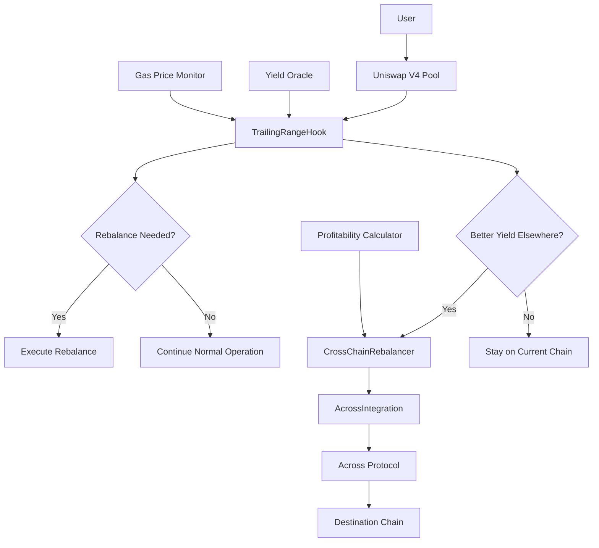

# 🛠️ Cross-Chain Trailing-Range Rebalancer - Development Guide

This comprehensive guide will walk you through building the Cross-Chain Trailing-Range Rebalancer from scratch. You'll understand every component, how they work together, and how to extend the system.

## 📚 Table of Contents

1. [Project Overview](#project-overview)
2. [Core Concepts](#core-concepts)
3. [Architecture Deep Dive](#architecture-deep-dive)
4. [Smart Contract Development](#smart-contract-development)
5. [Testing Strategy](#testing-strategy)
6. [Deployment Process](#deployment-process)
7. [Monitoring & Maintenance](#monitoring--maintenance)
8. [Extension Guide](#extension-guide)

## 🎯 Project Overview

### What We're Building

The Cross-Chain Trailing-Range Rebalancer is a sophisticated DeFi system that:

1. **Automatically manages Uniswap v4 liquidity positions**
2. **Rebalances positions when price moves out of range**
3. **Migrates liquidity to chains with better yields**
4. **Optimizes capital efficiency for liquidity providers**

### Why It Matters

Traditional liquidity provision suffers from:
- ❌ Positions going out of range (no fees earned)
- ❌ Manual rebalancing required
- ❌ Single-chain limitations
- ❌ Impermanent loss from wide ranges

Our solution provides:
- ✅ Automatic position management
- ✅ Cross-chain yield optimization
- ✅ Reduced impermanent loss
- ✅ Maximized fee capture

## 🧠 Core Concepts

### 1. Uniswap v4 Hooks

Hooks are contracts that can execute custom logic at specific points in pool operations:

```solidity
// Hook execution points
beforeInitialize() // Before pool creation
afterInitialize()  // After pool creation
beforeSwap()       // Before every swap
afterSwap()        // After every swap
beforeAddLiquidity() // Before adding liquidity
afterAddLiquidity()  // After adding liquidity
```

### 2. Trailing Range Strategy

A trailing range maintains liquidity around the current price:

```
Price Movement:
Time 1: |---[====X====]---|  (X = current price, [====] = liquidity range)
Time 2: |------[====X====]|  (price moved right, range follows)
Time 3: |-----[====X====]-|  (range rebalanced to center around price)
```

### 3. Cross-Chain Yield Arbitrage

Different chains offer different yields due to:
- Gas costs
- TVL levels
- User activity
- Ecosystem incentives

Our system finds the most profitable chain and migrates liquidity there.

### 4. Across Protocol Integration

Across Protocol provides secure, fast cross-chain transfers using:
- **Optimistic verification**: Fast settlement with fraud proofs
- **Relayer network**: Decentralized bridge operators
- **Spoke pools**: Chain-specific bridge contracts

## 🏗️ Architecture Deep Dive

### System Components



### Data Flow

1. **User Action**: Trader performs swap
2. **Hook Trigger**: `beforeSwap()` and `afterSwap()` execute
3. **Rebalance Check**: Compare current price to position range
4. **Yield Check**: Compare current chain yield to other chains
5. **Decision**: Rebalance locally or migrate cross-chain
6. **Execution**: Execute chosen strategy
7. **Monitoring**: Log events and update metrics

## 🔧 Smart Contract Development

### 1. TrailingRangeHook Contract

This is the core contract that implements the Uniswap v4 hook interface:

#### Key Functions:

```solidity
contract TrailingRangeHook is BaseHook, Ownable {
    // Configuration for each pool
    struct PoolConfig {
        uint24 rebalanceThreshold; // When to rebalance (basis points)
        uint24 rangeWidth;         // Width of liquidity range
        uint256 minLiquidity;      // Minimum liquidity to maintain
        bool crossChainEnabled;    // Whether cross-chain is allowed
        uint256 lastRebalanceBlock; // Cooldown mechanism
        int24 currentLowerTick;    // Current position lower bound
        int24 currentUpperTick;    // Current position upper bound
    }
    
    mapping(PoolId => PoolConfig) public poolConfigs;
    mapping(PoolId => uint256) public poolLiquidity;
    
    // Core hook functions
    function afterInitialize(...) external override returns (bytes4) {
        // Set up initial position configuration
    }
    
    function beforeSwap(...) external override returns (bytes4, BeforeSwapDelta, uint24) {
        // Check if rebalancing is needed
        _checkAndRebalance(key);
    }
    
    function afterSwap(...) external override returns (bytes4, int128) {
        // Monitor cross-chain opportunities
        _monitorCrossChainOpportunities(key);
    }
}
```

#### Implementation Details:

**Rebalancing Logic:**
```solidity
function _checkAndRebalance(PoolKey calldata key) internal {
    PoolId poolId = key.toId();
    PoolConfig storage config = poolConfigs[poolId];
    
    // Respect cooldown period
    if (block.number - config.lastRebalanceBlock < REBALANCE_COOLDOWN) return;
    
    // Get current pool state
    (uint160 sqrtPriceX96, int24 currentTick,,) = poolManager.getSlot0(poolId);
    
    // Calculate distance from center of range
    int24 tickDistance = _getTickDistance(currentTick, config.currentLowerTick, config.currentUpperTick);
    
    // Rebalance if price moved too far
    if (uint24(tickDistance) > config.rebalanceThreshold) {
        _executeRebalance(key, currentTick, config);
    }
}
```

**Cross-Chain Monitoring:**
```solidity
function _monitorCrossChainOpportunities(PoolKey calldata key) internal {
    PoolId poolId = key.toId();
    PoolConfig storage config = poolConfigs[poolId];
    
    if (!config.crossChainEnabled) return;
    
    // Get best yield opportunity
    (uint256 bestChainId, uint256 yieldDifference) = acrossIntegration.getBestYieldOpportunity(
        address(key.currency0),
        address(key.currency1)
    );
    
    // Initiate migration if profitable
    if (bestChainId != block.chainid && yieldDifference > YIELD_THRESHOLD) {
        _initiateCrossChainMigration(key, bestChainId);
    }
}
```

### 2. AcrossIntegration Contract

Handles all cross-chain operations:

```solidity
contract AcrossIntegration is IAcrossIntegration, Ownable, ReentrancyGuard {
    // Yield data for each chain and token pair
    mapping(uint256 => mapping(address => mapping(address => YieldData))) public yieldData;
    
    // Spoke pool addresses for each chain
    mapping(uint256 => address) public spokePools;
    
    function getBestYieldOpportunity(address token0, address token1) 
        external view returns (uint256 bestChainId, uint256 yieldDifference) 
    {
        // Compare yields across all supported chains
        uint256 currentChainYield = yieldData[block.chainid][token0][token1].apy;
        uint256 bestYield = currentChainYield;
        bestChainId = block.chainid;
        
        for (uint256 i = 0; i < supportedChains.length; i++) {
            uint256 chainId = supportedChains[i];
            YieldData memory data = yieldData[chainId][token0][token1];
            
            if (data.apy > bestYield) {
                bestYield = data.apy;
                bestChainId = chainId;
            }
        }
        
        yieldDifference = bestYield > currentChainYield ? bestYield - currentChainYield : 0;
    }
    
    function bridgeAssets(
        address token0, address token1,
        uint256 amount0, uint256 amount1,
        uint256 destinationChainId,
        address recipient
    ) external nonReentrant {
        // Validate parameters
        require(spokePools[destinationChainId] != address(0), "Chain not supported");
        
        // Bridge each token via Across Protocol
        if (amount0 > 0) _bridgeToken(token0, amount0, destinationChainId, recipient);
        if (amount1 > 0) _bridgeToken(token1, amount1, destinationChainId, recipient);
    }
}
```

### 3. CrossChainRebalancer Contract

Orchestrates migration decisions:

```solidity
contract CrossChainRebalancer is Ownable, ReentrancyGuard, Pausable {
    function initiateMigration(
        address token0, address token1,
        uint256 amount0, uint256 amount1,
        uint256 targetChain
    ) external returns (bytes32 migrationId) {
        // Calculate total value
        uint256 totalValue = _calculateTotalValue(token0, token1, amount0, amount1);
        
        // Check profitability
        (bool isProfitable, uint256 expectedYield, uint256 estimatedCost) = 
            _evaluateMigration(block.chainid, targetChain, token0, token1, totalValue);
        require(isProfitable, "Migration not profitable");
        
        // Generate unique migration ID
        migrationId = keccak256(abi.encodePacked(
            msg.sender, block.chainid, targetChain, 
            token0, token1, amount0, amount1, 
            block.timestamp, migrationCounter++
        ));
        
        // Store migration data
        migrations[migrationId] = Migration({
            user: msg.sender,
            fromChain: block.chainid,
            toChain: targetChain,
            // ... other fields
        });
        
        // Execute migration
        _executeMigration(migrationId);
    }
}
```

### 4. Mathematical Libraries

#### PositionMath.sol
```solidity
library PositionMath {
    function alignToTickSpacing(int24 tick, uint24 fee) internal pure returns (int24) {
        int24 tickSpacing = getTickSpacing(fee);
        return tick / tickSpacing * tickSpacing;
    }
    
    function calculateLiquidityFromBalances(
        uint256 amount0, uint256 amount1,
        int24 tickLower, int24 tickUpper
    ) internal pure returns (uint128 liquidity) {
        // Use Uniswap's math libraries for precise calculations
        uint160 sqrtPriceAX96 = TickMath.getSqrtRatioAtTick(tickLower);
        uint160 sqrtPriceBX96 = TickMath.getSqrtRatioAtTick(tickUpper);
        uint160 sqrtPriceX96 = uint160((uint256(sqrtPriceAX96) + uint256(sqrtPriceBX96)) / 2);
        
        return LiquidityAmounts.getLiquidityForAmounts(
            sqrtPriceX96, sqrtPriceAX96, sqrtPriceBX96, amount0, amount1
        );
    }
}
```

#### CrossChainUtils.sol
```solidity
library CrossChainUtils {
    function calculateOptimalSlippage(
        uint256 chainId, uint256 volatility, uint256 bridgeTime
    ) internal pure returns (uint256 slippage) {
        uint256 baseSlippage = _getBaseSlippageForChain(chainId);
        uint256 volatilitySlippage = (volatility * bridgeTime) / 3600;
        uint256 timeSlippage = (bridgeTime * 10) / 3600;
        
        slippage = baseSlippage + volatilitySlippage + timeSlippage;
        if (slippage > 1000) slippage = 1000; // Cap at 10%
    }
    
    function isTimeSensitiveMigration(
        uint256 currentYield, uint256 targetYield,
        uint256 positionValue, uint256 timeWindow
    ) internal pure returns (bool) {
        if (targetYield <= currentYield) return false;
        
        uint256 yieldDifference = targetYield - currentYield;
        uint256 opportunityCost = (positionValue * yieldDifference * timeWindow) / (365 days * 10000);
        
        return opportunityCost > (positionValue / 1000); // 0.1% threshold
    }
}
```

## 🧪 Testing Strategy

### 1. Unit Tests

Test individual contract functions in isolation:

```javascript
describe("TrailingRangeHook", function () {
    describe("Rebalancing Logic", function () {
        it("Should trigger rebalancing when price moves beyond threshold", async function () {
            // Setup initial position
            await hook.setPoolConfig(poolId, 100, 60, true); // 1% threshold, 60 tick width
            
            // Move price significantly
            await mockPoolManager.setSlot0(poolId, { tick: 200 }); // Move 200 ticks
            
            // Trigger rebalancing check
            await hook.beforeSwap(trader.address, poolKey, swapParams, "0x");
            
            // Verify rebalancing occurred
            const config = await hook.poolConfigs(poolId);
            expect(config.lastRebalanceBlock).to.be.gt(initialBlock);
        });
    });
});
```

### 2. Integration Tests

Test complete workflows:

```javascript
describe("Cross-Chain Migration", function () {
    it("Should execute full migration workflow", async function () {
        // 1. Setup yield data showing better opportunity on another chain
        await acrossIntegration.updateYieldData(137, token0.address, token1.address, 800, tvl, gasPrice);
        
        // 2. Approve tokens for migration
        await token0.approve(crossChainRebalancer.address, amount);
        
        // 3. Initiate migration
        const tx = await crossChainRebalancer.initiateMigration(
            token0.address, token1.address, amount0, amount1, 137
        );
        
        // 4. Verify events were emitted
        await expect(tx).to.emit(crossChainRebalancer, "MigrationInitiated");
        
        // 5. Check migration was recorded
        const migration = await crossChainRebalancer.getMigration(migrationId);
        expect(migration.status).to.equal(MigrationStatus.InProgress);
    });
});
```

### 3. Fuzzing Tests

Test with random inputs to find edge cases:

```javascript
describe("Fuzzing Tests", function () {
    it("Should handle random price movements", async function () {
        for (let i = 0; i < 100; i++) {
            const randomTick = Math.floor(Math.random() * 200000) - 100000;
            await mockPoolManager.setSlot0(poolId, { tick: randomTick });
            
            // Should not revert regardless of price
            await expect(
                hook.beforeSwap(trader.address, poolKey, swapParams, "0x")
            ).to.not.be.reverted;
        }
    });
});
```

### 4. Gas Optimization Tests

Ensure operations stay within gas limits:

```javascript
describe("Gas Optimization", function () {
    it("Should use reasonable gas for rebalancing", async function () {
        const tx = await hook.beforeSwap(trader.address, poolKey, swapParams, "0x");
        const receipt = await tx.wait();
        
        expect(receipt.gasUsed).to.be.lt(500000); // Less than 500k gas
    });
});
```

## 🚀 Deployment Process

### 1. Environment Setup

```bash
# Create .env file
cat > .env << EOF
PRIVATE_KEY=0x...
ETHEREUM_RPC_URL=https://mainnet.infura.io/v3/...
POLYGON_RPC_URL=https://polygon-rpc.com
# ... other chain URLs
ETHERSCAN_API_KEY=...
# ... other API keys
EOF
```

### 2. Deployment Script

```javascript
// scripts/deploy.js
async function main() {
    const [deployer] = await ethers.getSigners();
    const chainId = await deployer.getChainId();
    
    console.log(`Deploying to chain ${chainId} with account ${deployer.address}`);
    
    // 1. Deploy AcrossIntegration
    const AcrossIntegration = await ethers.getContractFactory("AcrossIntegration");
    const acrossIntegration = await AcrossIntegration.deploy(
        chainConfig.spokePool,
        chainConfig.priceOracle,
        deployer.address
    );
    await acrossIntegration.deployed();
    
    // 2. Deploy CrossChainRebalancer
    const CrossChainRebalancer = await ethers.getContractFactory("CrossChainRebalancer");
    const crossChainRebalancer = await CrossChainRebalancer.deploy(
        acrossIntegration.address,
        deployer.address
    );
    await crossChainRebalancer.deployed();
    
    // 3. Deploy TrailingRangeHook
    const TrailingRangeHook = await ethers.getContractFactory("TrailingRangeHook");
    const hook = await TrailingRangeHook.deploy(
        chainConfig.poolManager,
        acrossIntegration.address
    );
    await hook.deployed();
    
    // 4. Configure contracts
    await configureContracts({ acrossIntegration, crossChainRebalancer, hook });
    
    // 5. Save deployment info
    await saveDeploymentInfo({ acrossIntegration, crossChainRebalancer, hook }, chainId);
}
```

### 3. Configuration

```javascript
async function configureContracts(contracts) {
    const { acrossIntegration, crossChainRebalancer, hook } = contracts;
    
    // Configure supported chains
    const chains = [
        { id: 1, spokePool: "0x5c7BCd6E7De5423a257D81B442095A1a6ced35C5" },
        { id: 137, spokePool: "0x9295ee1d8C5b022Be115A2AD3c30C72E34e7F096" },
        // ... other chains
    ];
    
    for (const chain of chains) {
        await acrossIntegration.setSpokePool(chain.id, chain.spokePool);
        await crossChainRebalancer.setSupportedChain(chain.id, true);
        await hook.setCrossChainConfig(chain.id, chain.spokePool, gasThreshold, yieldThreshold);
    }
    
    // Set authorizations
    await acrossIntegration.setAuthorizedUpdater(yieldOracleAddress, true);
    await crossChainRebalancer.setAuthorizedCaller(hook.address, true);
}
```

## 📊 Monitoring & Maintenance

### 1. Real-time Monitoring

The monitoring system tracks:

```javascript
class RebalancerMonitor {
    async initialize() {
        // Setup providers for each chain
        await this.setupProviders();
        
        // Load contract instances
        await this.loadContracts();
        
        // Setup event listeners
        await this.setupEventListeners();
    }
    
    async setupEventListeners() {
        // Listen for rebalancing events
        this.hook.on("PositionRebalanced", (poolId, newLowerTick, newUpperTick, liquidity) => {
            this.handleRebalanceEvent({ poolId, newLowerTick, newUpperTick, liquidity });
        });
        
        // Listen for cross-chain migrations
        this.hook.on("CrossChainMigrationInitiated", (poolId, destChain, amount0, amount1) => {
            this.handleMigrationEvent({ poolId, destChain, amount0, amount1 });
        });
    }
    
    async performHealthCheck() {
        for (const [chainId, provider] of Object.entries(this.providers)) {
            try {
                const blockNumber = await provider.getBlockNumber();
                this.healthStatus[chainId] = { status: 'healthy', blockNumber };
            } catch (error) {
                this.healthStatus[chainId] = { status: 'unhealthy', error: error.message };
            }
        }
    }
}
```

### 2. Yield Data Updates

Oracles continuously update yield data:

```javascript
// Yield oracle service
async function updateYieldData() {
    const chains = [1, 137, 42161, 10, 8453];
    const tokenPairs = [
        { token0: USDC_ADDRESS, token1: WETH_ADDRESS },
        { token0: USDC_ADDRESS, token1: DAI_ADDRESS }
    ];
    
    for (const chainId of chains) {
        for (const pair of tokenPairs) {
            // Fetch current yield data from various sources
            const yieldData = await fetchYieldData(chainId, pair.token0, pair.token1);
            
            // Update on-chain
            await acrossIntegration.updateYieldData(
                chainId,
                pair.token0,
                pair.token1,
                yieldData.apy,
                yieldData.tvl,
                yieldData.gasPrice
            );
        }
    }
}
```

### 3. Emergency Response

```javascript
// Emergency response procedures
async function handleEmergency(emergencyType, poolId) {
    switch (emergencyType) {
        case 'HIGH_VOLATILITY':
            // Pause rebalancing temporarily
            await hook.emergencyPause(poolId, "High volatility detected");
            break;
            
        case 'BRIDGE_FAILURE':
            // Disable cross-chain migrations
            await crossChainRebalancer.pause();
            break;
            
        case 'EXPLOIT_DETECTED':
            // Full system shutdown
            await hook.pause();
            await crossChainRebalancer.pause();
            await acrossIntegration.pauseBridging();
            break;
    }
}
```

## 🔧 Extension Guide

### 1. Adding New Chains

To add support for a new blockchain:

```solidity
// 1. Update AcrossIntegration contract
function addNewChain(uint256 chainId, address spokePool) external onlyOwner {
    spokePools[chainId] = spokePool;
    supportedChains.push(chainId);
    emit NewChainAdded(chainId, spokePool);
}

// 2. Update CrossChainRebalancer
await crossChainRebalancer.setSupportedChain(newChainId, true);

// 3. Update Hook configuration
await hook.setCrossChainConfig(newChainId, spokePool, gasThreshold, yieldThreshold);

// 4. Update monitoring
monitor.addChain(newChainId, rpcUrl);
```

### 2. Adding New Rebalancing Strategies

Extend the hook with additional strategies:

```solidity
enum RebalanceStrategy {
    TRAILING_RANGE,    // Current implementation
    MEAN_REVERSION,    // New strategy
    VOLATILITY_BASED,  // New strategy
    CUSTOM            // User-defined
}

struct StrategyConfig {
    RebalanceStrategy strategy;
    bytes parameters; // Strategy-specific parameters
}

mapping(PoolId => StrategyConfig) public strategyConfigs;

function executeStrategy(PoolKey calldata key, int24 currentTick) internal {
    PoolId poolId = key.toId();
    StrategyConfig memory config = strategyConfigs[poolId];
    
    if (config.strategy == RebalanceStrategy.TRAILING_RANGE) {
        _executeTrailingRange(key, currentTick);
    } else if (config.strategy == RebalanceStrategy.MEAN_REVERSION) {
        _executeMeanReversion(key, currentTick, config.parameters);
    }
    // ... other strategies
}
```

### 3. Adding Custom Oracles

Integrate additional data sources:

```solidity
interface IPriceOracle {
    function getPrice(address token0, address token1) external view returns (uint256);
    function getVolatility(address token0, address token1) external view returns (uint256);
}

interface IYieldOracle {
    function getYield(uint256 chainId, address token0, address token1) external view returns (uint256);
}

contract OracleAggregator {
    IPriceOracle[] public priceOracles;
    IYieldOracle[] public yieldOracles;
    
    function getAggregatedPrice(address token0, address token1) external view returns (uint256) {
        uint256 total = 0;
        uint256 count = 0;
        
        for (uint256 i = 0; i < priceOracles.length; i++) {
            try priceOracles[i].getPrice(token0, token1) returns (uint256 price) {
                total += price;
                count++;
            } catch {
                // Skip failed oracle
            }
        }
        
        require(count > 0, "No oracles available");
        return total / count;
    }
}
```

### 4. Advanced Features

#### MEV Protection
```solidity
contract MEVProtection {
    mapping(bytes32 => uint256) private lastRebalanceBlock;
    uint256 private constant MEV_PROTECTION_BLOCKS = 3;
    
    modifier mevProtected(bytes32 poolId) {
        require(
            block.number >= lastRebalanceBlock[poolId] + MEV_PROTECTION_BLOCKS,
            "MEV protection active"
        );
        _;
        lastRebalanceBlock[poolId] = block.number;
    }
}
```

#### Dynamic Fee Optimization
```solidity
function calculateOptimalFee(
    PoolKey memory key,
    uint256 volume24h,
    uint256 volatility
) internal pure returns (uint24 optimalFee) {
    // Higher volatility = higher fee to compensate for IL
    // Higher volume = lower fee to attract more trades
    uint256 baseFee = 3000; // 0.3%
    uint256 volatilityAdjustment = (volatility * 2000) / 10000; // Up to +0.2%
    uint256 volumeAdjustment = volume24h > 1000000e18 ? 500 : 0; // -0.05% for high volume
    
    optimalFee = uint24(baseFee + volatilityAdjustment - volumeAdjustment);
    
    // Ensure within bounds
    if (optimalFee < 500) optimalFee = 500;   // Min 0.05%
    if (optimalFee > 10000) optimalFee = 10000; // Max 1%
}
```

#### Liquidity Mining Integration
```solidity
interface ILiquidityMining {
    function stake(address user, uint256 amount) external;
    function unstake(address user, uint256 amount) external;
    function getRewards(address user) external view returns (uint256);
}

contract RewardOptimizer {
    ILiquidityMining[] public miningContracts;
    
    function optimizeRewards(PoolId poolId) external {
        // Compare rewards across different protocols
        uint256 bestReward = 0;
        ILiquidityMining bestContract;
        
        for (uint256 i = 0; i < miningContracts.length; i++) {
            uint256 reward = miningContracts[i].getRewards(address(this));
            if (reward > bestReward) {
                bestReward = reward;
                bestContract = miningContracts[i];
            }
        }
        
        // Migrate to best rewards program
        if (address(bestContract) != address(0)) {
            _migrateToRewardProgram(poolId, bestContract);
        }
    }
}
```

## 🎓 Best Practices

### 1. Security
- Always use reentrancy guards
- Implement proper access controls
- Add emergency pause mechanisms
- Validate all inputs
- Use battle-tested libraries (OpenZeppelin)

### 2. Gas Optimization
- Pack structs efficiently
- Use events for off-chain data
- Implement proper cooldowns
- Batch operations when possible
- Cache frequently accessed data

### 3. Testing
- Achieve >95% test coverage
- Test edge cases and failure scenarios
- Use fuzzing for complex logic
- Test on multiple networks
- Simulate real trading conditions

### 4. Monitoring
- Track all important metrics
- Set up alerting for anomalies
- Monitor cross-chain state consistency
- Log detailed information for debugging
- Regular health checks

### 5. Upgradability
- Use proxy patterns for upgradeable contracts
- Implement proper governance mechanisms
- Plan for emergency upgrades
- Test upgrade procedures thoroughly
- Maintain backward compatibility

This comprehensive guide provides everything you need to understand, build, and extend the Cross-Chain Trailing-Range Rebalancer. The system represents a significant advancement in DeFi infrastructure, combining automated market making with cross-chain optimization for maximum capital efficiency.

Remember: This is experimental technology. Always thoroughly test and audit before deploying with real funds! 