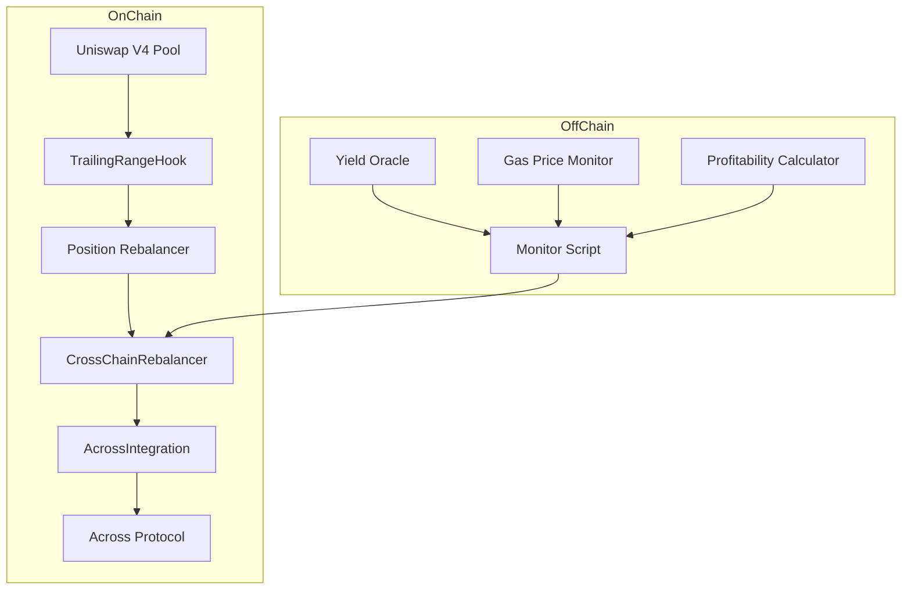
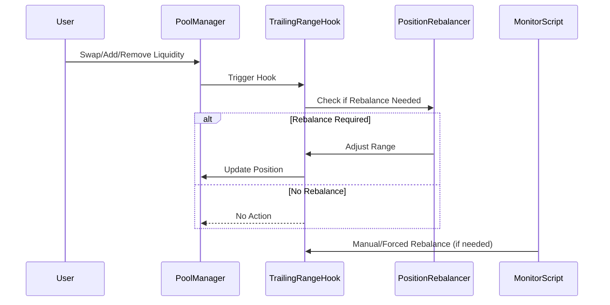
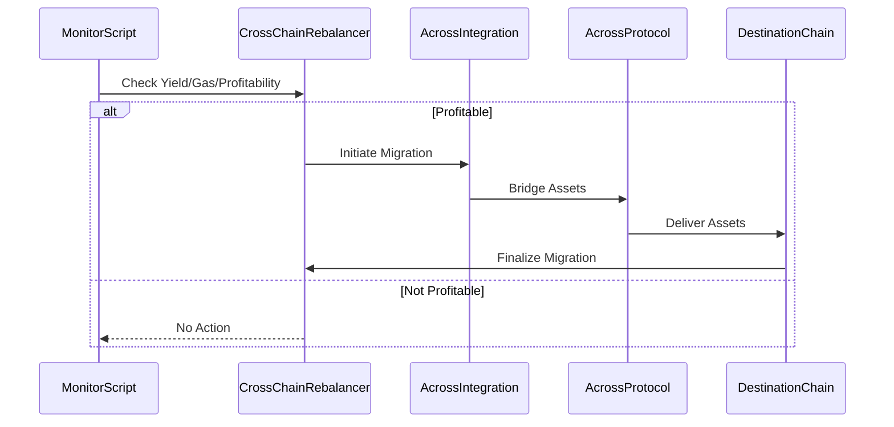
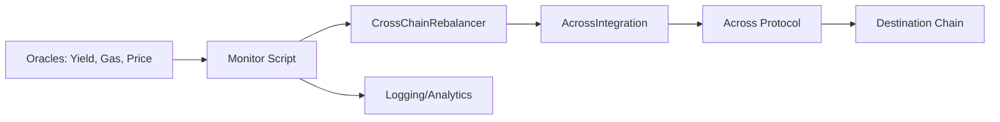
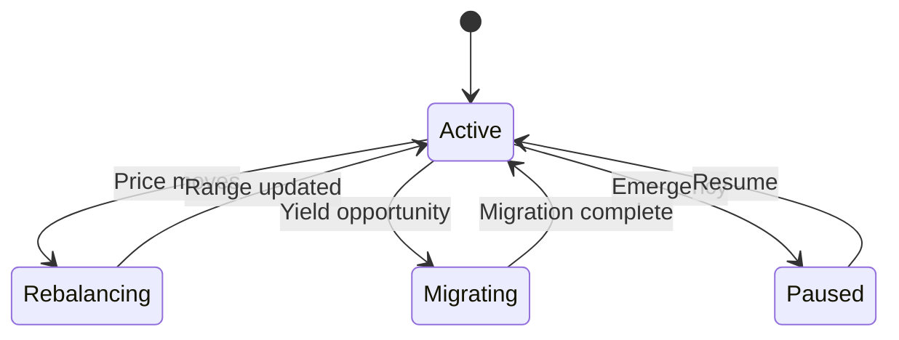

# 🌉 Cross-Chain Trailing-Range Rebalancer

> A revolutionary Uniswap v4 hook that automatically maintains active liquidity positions and migrates them across chains for optimal yield.

---

## 🚀 Overview

The Cross-Chain Trailing-Range Rebalancer is an advanced DeFi infrastructure project that combines:

- **Uniswap v4 Hooks**: Automatic liquidity position management
- **Across Protocol Integration**: Secure cross-chain asset bridging
- **Intelligent Rebalancing**: Dynamic tick range adjustment based on price movements
- **Yield Optimization**: Cross-chain migration for better returns
- **Capital Efficiency**: Maximized fee capture for liquidity providers

---

## 🏗️ High-Level Architecture

### System Component Diagram

**Explanation:**
- **Uniswap V4 Pool**: Where liquidity is provided.
- **TrailingRangeHook**: The main hook contract, intercepts pool events and manages position logic.
- **Position Rebalancer**: Adjusts tick ranges and liquidity based on price.
- **CrossChainRebalancer**: Orchestrates migration of liquidity across chains.
- **AcrossIntegration**: Handles cross-chain messaging and bridging via Across Protocol.
- **Monitor Script**: Off-chain bot that monitors events, triggers rebalances, and submits transactions.
- **Oracles/Monitors**: Feed real-time data (yield, gas, profitability) to the system.

---

### Sequence Diagram: Rebalancing Flow (Single Chain)

---

### Sequence Diagram: Cross-Chain Migration

---

## 🧩 Core Contracts & Components

### 1. `TrailingRangeHook.sol`
- **Purpose:** Implements Uniswap v4 hook interface to manage liquidity positions automatically.
- **Key Functions:**
  - `onSwap()`: Triggers on every swap, checks if rebalance is needed.
  - `manualRebalance()`: Allows off-chain bot or manager to force a rebalance.
  - `setPoolConfig()`: Configures thresholds, tick ranges, and cross-chain settings.
- **Interactions:**
  - Reads pool state, interacts with PositionMath for calculations, calls CrossChainRebalancer for migrations.

### 2. `AcrossIntegration.sol`
- **Purpose:** Handles cross-chain asset bridging using Across Protocol.
- **Key Functions:**
  - `bridgeAssets()`: Initiates a bridge transaction to another chain.
  - `setSpokePool()`: Configures supported chains and spoke pools.
  - `updateYieldData()`: Receives yield/gas data from oracles.
- **Interactions:**
  - Called by CrossChainRebalancer, interacts with Across Protocol contracts.

### 3. `CrossChainRebalancer.sol`
- **Purpose:** Orchestrates cross-chain migration logic and profitability checks.
- **Key Functions:**
  - `estimateMigrationProfitability()`: Calculates if migration is worth it.
  - `initiateMigration()`: Starts the migration process.
  - `pause()`: Emergency pause for all migrations.
- **Interactions:**
  - Calls AcrossIntegration, receives data from Monitor Script.

### 4. `PositionMath.sol`
- **Purpose:** Pure math library for tick and liquidity calculations.
- **Key Functions:**
  - `calculateNewRange()`: Computes optimal tick range.
  - `liquidityDelta()`: Determines how much liquidity to add/remove.

### 5. `CrossChainUtils.sol`
- **Purpose:** Utility functions for cross-chain operations (encoding, chain IDs, etc).

---

## 🔄 Detailed Flow Explanations

### A. On-Chain Rebalancing (Single Chain)
1. **Trigger:**
   - Swap or liquidity event occurs in Uniswap v4 pool.
2. **Hook Activation:**
   - `TrailingRangeHook` intercepts the event.
3. **Rebalance Check:**
   - Compares current price to range center, checks cooldown and thresholds.
4. **Rebalance Execution:**
   - If needed, calculates new tick range and updates position.
5. **Result:**
   - Liquidity stays centered, maximizing fee capture.

### B. Cross-Chain Migration
1. **Monitoring:**
   - Off-chain Monitor Script fetches yield, gas, and price data from oracles.
2. **Profitability Calculation:**
   - Calls `estimateMigrationProfitability()` on `CrossChainRebalancer`.
3. **Migration Decision:**
   - If profitable, triggers `initiateMigration()`.
4. **Bridging:**
   - `AcrossIntegration` bridges assets to target chain via Across Protocol.
5. **Finalization:**
   - On destination chain, new position is created and managed by hook.

### C. Yield & Gas Monitoring
- **Oracles** feed real-time data to the Monitor Script.
- **Monitor Script** aggregates data, triggers rebalances/migrations as needed.

---

## 🧑‍💻 Technical Deep Dive

### Uniswap v4 Hooks
- Hooks are smart contracts that can intercept and react to pool events (swaps, liquidity changes).
- `TrailingRangeHook` implements the IHooks interface, allowing it to:
  - Automatically rebalance positions
  - Enforce custom logic (cooldowns, thresholds)
  - Trigger cross-chain migrations

### Cross-Chain Messaging & Bridging
- Uses Across Protocol for secure, fast asset transfers between chains.
- `AcrossIntegration` abstracts the bridging logic, supporting multiple chains and tokens.
- Migration is only triggered if yield improvement exceeds gas and slippage costs.

### Gas Optimization
- **Cooldowns:** Prevents frequent rebalancing.
- **Batching:** Combines multiple actions in a single transaction when possible.
- **Gas Price Monitoring:** Waits for favorable gas conditions before acting.

### Security Mechanisms
- **Access Control:** Only owner/managers can change configs or trigger emergency actions.
- **Emergency Pause:** Can halt all operations in case of abnormal conditions.
- **Slippage Protection:** Limits on max slippage during migrations.
- **Profitability Checks:** Ensures migrations are only done when economically viable.

---

## 📊 Monitoring & Analytics

### Monitor Script
- **Purpose:** Off-chain bot that watches on-chain events, yield, and gas data.
- **Features:**
  - Detects when rebalancing or migration is needed
  - Submits transactions to contracts
  - Logs events and alerts
- **Data Sources:**
  - On-chain events
  - Oracles (yield, gas, price)

### Data Flow Diagram

---

## ⚙️ Configuration & Extensibility

### Adding New Chains
- Call `setSpokePool(newChainId, spokePoolAddress)` on `AcrossIntegration`.
- Call `setSupportedChain(newChainId, true)` on `CrossChainRebalancer`.

### Tuning Parameters
- Use `setPoolConfig()` on `TrailingRangeHook` to adjust:
  - Rebalance threshold
  - Tick range width
  - Cross-chain enable/disable
- Use `setCrossChainConfig()` to set:
  - Gas price threshold
  - Yield improvement threshold

---

## 🧪 Testing & Development

### Writing New Tests
- Place test files in `test/` directory.
- Use Hardhat's test runner: `npx hardhat test`.
- Simulate cross-chain events by mocking oracle data and bridge calls.

### Local Simulation
- Start local Hardhat node: `npx hardhat node`
- Deploy contracts: `npx hardhat run scripts/deploy.js --network localhost`
- Run monitor: `node scripts/monitor.js`

---

## 📈 Visuals & State Machines

### State Machine: Position Lifecycle

---

## 📄 License

This project is licensed under the MIT License - see the [LICENSE](LICENSE) file for details.

---

## 🙏 Acknowledgments

- **Uniswap Labs**: For the revolutionary v4 hook system
- **Across Protocol**: For secure cross-chain infrastructure
- **OpenZeppelin**: For battle-tested smart contract libraries
- **Hardhat**: For excellent development tooling

---

**⚠️ Disclaimer**: This software is in active development. Use at your own risk in production environments. Always audit smart contracts before deployment with real funds.
